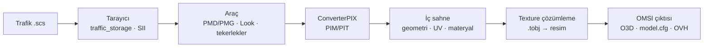

<div align="center">

# ETS2OMSI

**Euro Truck Simulator 2 trafik araçlarını OMSI 2 AI araçlarına dönüştürür.**


[İndir](#indirme) · [Kullanım](#kullanım) · [Nasıl çalışır](#nasıl-çalışır) · [Sorun giderme](#sorun-giderme) · [Geliştirme](#geliştirme) · [Sürüm notları](CHANGELOG.md)

</div>

---

## Genel bakış

ETS2OMSI, tek bir ETS2 trafik paketindeki (`.scs`) otomobilleri tarar ve her birini OMSI 2'ye kopyalanmaya hazır bir AI aracı olarak dışa aktarır: gövde ve ayrı tekerlek modelleri (`.o3d`), texture'lar, `model.cfg`, `.ovh` ve AI ayarları.

| Gerekmez | Gerekir |
|---|---|
| ETS2 kurulumu, DLC, Blender, Go | Windows 10/11 ve bir ETS2 trafik paketi (`.scs`) |

> Kapsam: yalnızca otomobiller, yalnızca dış görünüş. Tır, otobüs ve iç mekân dönüştürülmez.

## Özellikler

- **Tek pencerede çalışma** — paket tarama, araç listesi, 3D önizleme ve toplu dönüştürme.
- **Oyun benzeri 3D önizleme** — gerçek texture'lar, ışık, yansıma, saydam cam; önizleme OMSI çıktısıyla birebir aynı veriyi kullanır.
- **Deterministik texture çözümleme** — her materyal için `.tobj` dosyası paketten okunur; tahmin yapılmaz.
- **Eksik texture üretimi** — ETS2'nin kendi dosyalarında kalan cam, far, stop, sinyal, krom, jant ve lastik texture'ları otomatik üretilir.
- **ETS2 boya renkleri** — materyal `diffuse` rengi ve seçili renk varyasyonu (Look) texture'a işlenir.
- **Materyal teşhis listesi** — her parçanın texture'ının nereden geldiği ya da neden bulunamadığı gösterilir ve dışa aktarılabilir.
- **OMSI uyumlu çıktı** — doğru eksenler, tekerlek temas noktasına göre zemin, ayrı ve animasyonlu tekerlekler, kütleden hesaplanan süspansiyon.

## İndirme

1. **Code → Download ZIP** ile depoyu indirin ve bir klasöre çıkarın.
2. Program: [`release/ETS2OMSI.exe`](release/ETS2OMSI.exe)

İlk dönüşümde 3D model çözücü (ConverterPIX) otomatik indirilir; bunun için internet bağlantısı gerekir.

## Kullanım

1. `ETS2OMSI.exe` dosyasını çalıştırın. Program kendi penceresinde açılır.
2. **SCS Dosyası Seç** ile trafik paketini seçin ve **Arabaları Bul**'a tıklayın.
3. Bir araç seçip **3D önizleme**yi açın; alttaki **Materyaller** listesinden texture durumunu kontrol edin.
4. Araçları işaretleyip **OMSI'ye Dönüştür**'e tıklayın.
5. Oluşan araç klasörlerini `OMSI 2\Vehicles\` içine kopyalayın ve her klasördeki `ailists_snippet.txt` satırını haritanın `ailists.cfg` dosyasına ekleyin.

Ayrıntılı anlatım: [KULLANIM.md](KULLANIM.md)

### Çıktı yapısı

```text
ETS2OMSI_<Araç>/
├── <Araç>.ovh
├── model/
│   ├── model.cfg
│   ├── body.o3d
│   ├── lod_*.o3d
│   └── wheel_fl.o3d · wheel_fr.o3d · wheel_rl.o3d · wheel_rr.o3d
├── texture/
├── script/AI_constfile.txt
├── conversion_report.json · conversion_report.txt
└── ailists_snippet.txt
```

## Nasıl çalışır



**Texture çözümleme kuralları**

| Adım | Kural |
|---|---|
| 1 | Materyal → PIT'teki seçili Look → texture nesnesi (`.tobj`) |
| 2 | `.tobj` paketten okunur: resim yolu ve kenar davranışı (tekrar / clamp / ayna) |
| 3 | Resim yalnızca tam yolundan ya da aynı klasörde boşluk/alt çizgi farkıyla aranır |
| 4 | Ayna texture'lar OMSI için dönüştürülür; DX10 DDS ve TGA, OMSI uyumlu DDS'e çevrilir |
| 5 | Pakette olmayan texture'lar parça türüne göre üretilir (cam, far, stop, sinyal, krom, jant, lastik, iç mekân) |

Ayrıntılar: [docs/ARCHITECTURE.md](docs/ARCHITECTURE.md)

## Sorun giderme

| Belirti | Çözüm |
|---|---|
| Texture yanlış ya da eksik | Önizlemedeki **Materyaller** listesine bakın; **Teşhis dosyasını kaydet** ile oluşan `.json` dosyasını bir hata kaydına ekleyin. |
| Program açılmıyor | Log dosyası: `%LocalAppData%\ETS2OMSI\ETS2OMSI.log` |
| Pencere yerine tarayıcı açılıyor | Edge WebView2 yüklü değil; program tarayıcı moduna geçer, işlev aynıdır. |
| Araç OMSI'de görünmüyor | `ailists.cfg` satırını ve klasör adının `Vehicles` altında olduğunu kontrol edin. |

Hata bildirmek için: [yeni hata kaydı](https://github.com/talhababa31/ETS2OMSI/issues/new/choose)

## Geliştirme

```powershell
go vet ./...
go test -race ./...
$env:GOOS="windows"; $env:GOARCH="amd64"
go build -trimpath -ldflags "-s -w -H windowsgui" -o release/ETS2OMSI.exe ./cmd/ets2omsi-alpha
```

| Klasör | İçerik |
|---|---|
| `cmd/ets2omsi-alpha` | Masaüstü uygulaması (pencere, HTTP API, web arayüzü) |
| `cmd/ets2omsi-cli` | Komut satırı aracı |
| `internal/scanner` · `internal/sii` | Paket tarama, SII ayrıştırma |
| `internal/convert` | Dönüştürme hattı, texture çözümleme, önizleme |
| `internal/dds` | DDS çözücü (BC1–BC5, sıkıştırmasız, DX10) |
| `internal/o3d` · `internal/omsi` | OMSI O3D yazıcı, `model.cfg` / `.ovh` üretimi |

Derleme ayrıntıları: [BUILD.md](BUILD.md)

## Üçüncü taraf

- [ConverterPIX](https://github.com/mwl4/ConverterPIX) (LGPL-3.0) — ETS2 ikili modellerini çözmek için ayrı bir araç olarak kullanılır.
- Kütüphaneler: [go-webview2](https://github.com/jchv/go-webview2).

ETS2OMSI; ETS2, DLC, mod araç dosyaları veya OMSI içeriği dağıtmaz. Ayrıntı: [THIRD_PARTY_NOTICES.md](THIRD_PARTY_NOTICES.md)
